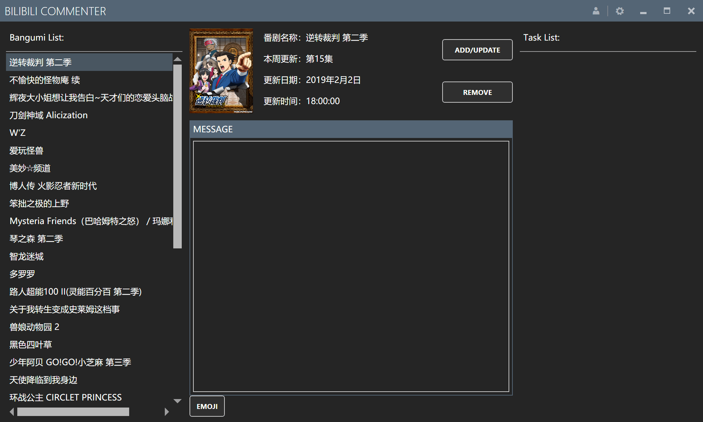
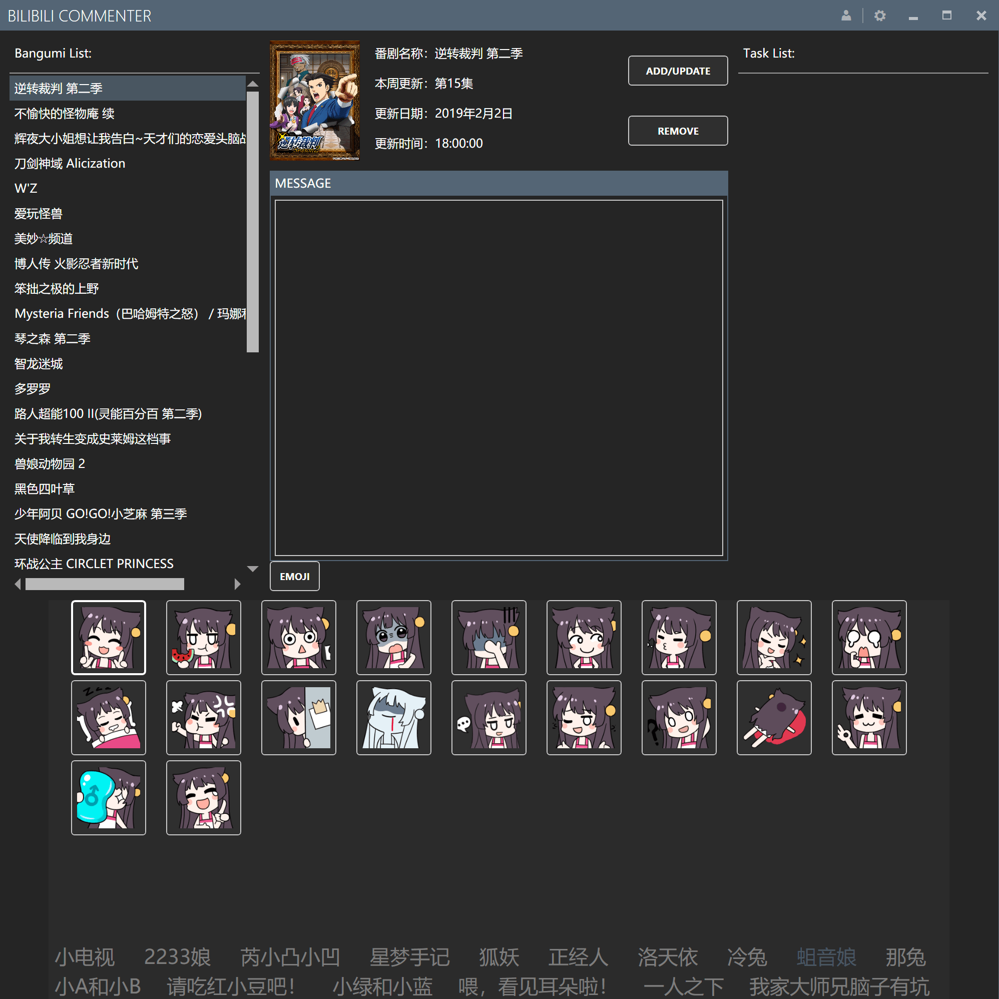
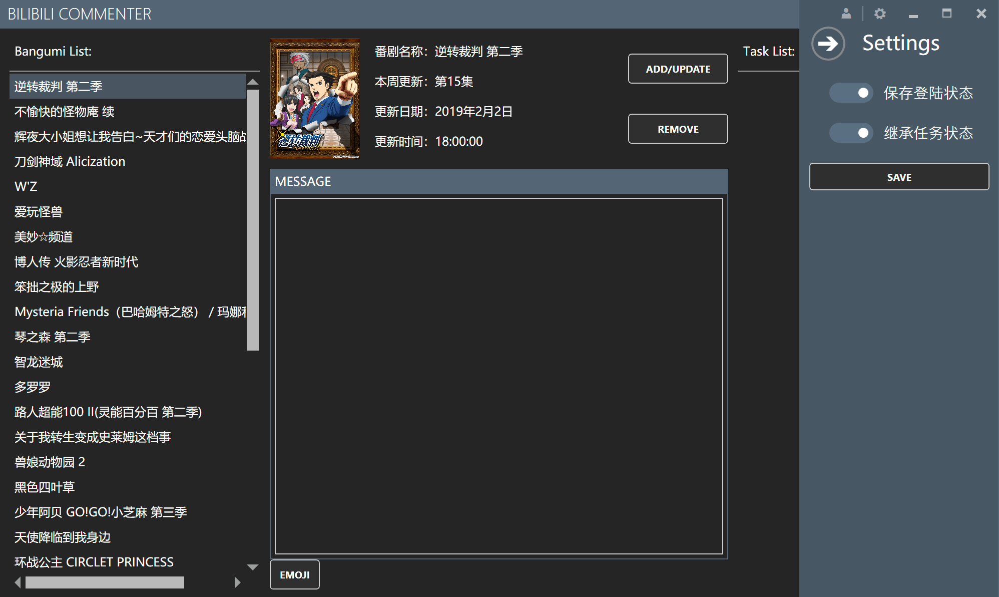
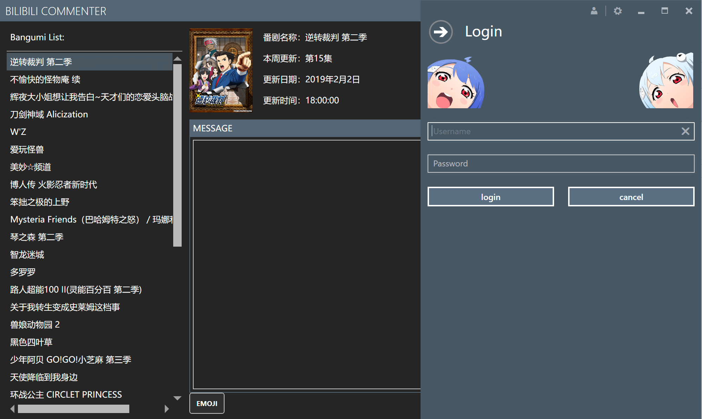

# BiliCommenter
## 由于B站把新番楼层显示去掉了……所以这个抢楼机实际上没有什么作用了……就Archive了⑧.

## Intro

A tool that helps you grab the front row in new animates.

哔哩哔哩新番抢楼机。

Coding: @AlaricGilbert

Logo Design: @ManiaciaChao

## To-do list

In upcoming version 0.3.x, we're going to add those functions and redirect our way to "Grab the front row in all the reply areas":

在0.3.x版本中加入下列功能，并将目标指向更改为“哔哩哔哩评论区前排助手”：

* [ ] Specified floor grabbing./抢指定楼层。
* [ ] Dynamics floor grabbing./动态抢楼。
* [ ] Exceptions handle./异常处理。

In further version 0.4.x, we're going to add those functions:

在0.4.x版本中加入下列功能：

* [ ] Master ball./在关注的动态中，对指定的人物投出“大师球”。
* [ ] Themes (optional)./主题。
* [ ] Login with CAPTCHA requirement./需要验证码的登陆处理。

~~1.0.0:~~

* ~~iOS/Android Support。(咕咕咕咕咕咕咕~)~~
* iOS/Android Support will be added in next version(0.3.x).

## Previews

